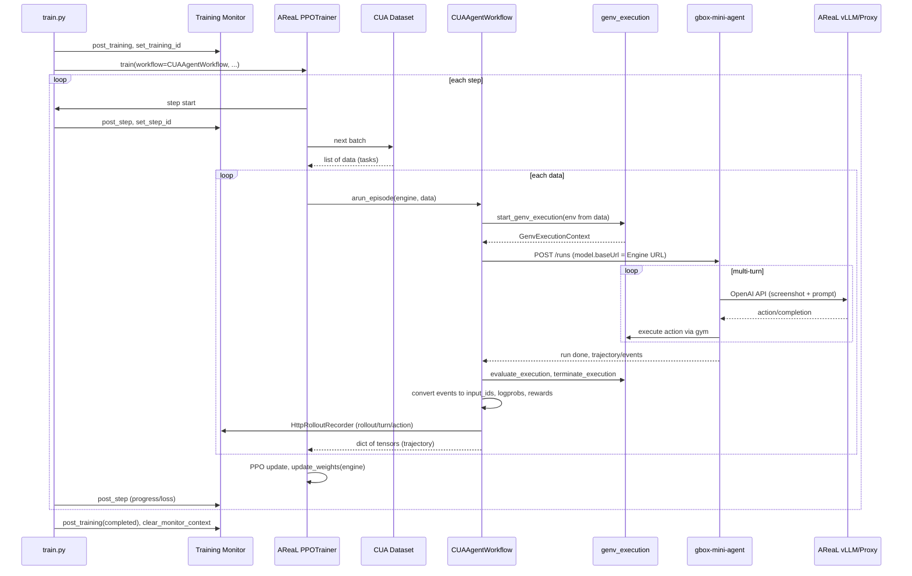

# AReaL CUA Agent 训练迁移计划

## 一、当前流程梳理

### 1.1 现有训练流程（tinker-cookbook）

- **入口与配置**：`tinker_cookbook/recipes/cua_rl/train_unsloth.py` 调用 `core/train_unsloth.py` 的 `cli_main(CLIConfig)`。
- **任务与数据**：`gym_env.py` 的 `GenvDatasetBuilder` 通过 `task_loader` + `gym_task_source` 从 **gym server** 加载任务列表，得到 `GenvDataset`；`get_batch(i)` 返回 `EnvGroupBuilder` 列表（每组含 `group_size` 个 env）。
- **Rollout**：`core/rollout.py` 的 `do_cua_group_rollout` 用 `genv_execution` 创建 gym 执行环境，调用 `mini_agent_runner.run_mini_agent_rollout` 向 **gbox-mini-agent** HTTP 发起 `/runs`；gbox-mini-agent 多轮：截图（TOS URL）→ 调用 vLLM → 解析 action → gym 执行 → 直至结束；最后 `evaluate_execution`、`terminate_execution`。
- **训练**：从 trajectory 得到 (messages, response_text, weight)，Unsloth 监督更新；每 `train_every` 批 reload vLLM。
- **监控**：IngestClient + monitor_context + HttpRolloutRecorder 向 Training Monitor 上报 training/step/task/rollout/baseline/eval。

### 1.2 AReaL 侧要点

- **PPOTrainer**：每步从 `train_dataloader` 取 batch，调用 `actor.prepare_batch(dataloader, workflow=..., workflow_kwargs=...)`；内部由 **RolloutController** 对每条 `data` 调用 `workflow.arun_episode(engine, data)`，再汇总成 rollout batch 做 PPO 更新、权重同步、eval、保存。
- **RolloutWorkflow**：`[areal/api/workflow_api.py](AReaL/areal/api/workflow_api.py)` 要求实现 `arun_episode(engine, data) -> dict | None`。返回为 **None** 表示丢弃该轨迹；否则需为 AReaL 可用的 trajectory 格式（如 `dict[str, torch.Tensor]`：`input_ids`、`loss_mask`、`logprobs`、`versions`、`rewards` 等，batch 维在最后一维）。
- **Engine**：训练脚本侧通过 `config.rollout` 配置的 inference engine（如 vLLM）；`engine.agenerate(req)` 用于单次生成。若使用 **Agent/Proxy 模式**，会启动 OpenAI 兼容 proxy，workflow 内通过 `ArealOpenAI(engine=engine, ...)` 等与 proxy 交互，由 proxy 转发到 AReaL 管理的 vLLM。
- **示例参考**：
  - `[examples/agent_workflow/train.py](AReaL/examples/agent_workflow/train.py)`：PPOTrainer + 自定义 config（workflow/eval_workflow/max_turns）+ `get_custom_dataset`，`trainer.train(workflow=..., workflow_kwargs=...)`。
  - `[examples/openai_agents/train_agents.py](AReaL/examples/openai_agents/train_agents.py)`：`OpenAIAgentWorkflow(RolloutWorkflow)` 用 `ArealOpenAI(engine, tokenizer)` 跑 agent，`arun_episode` 里 `run_agent` 得到 reward 后 `client.apply_reward_discount`、`client.export_interactions(style="individual")` 返回给 AReaL。

---

## 二、目标架构（AReaL 组织训练 + 复刻 RL-Trainable Agent）

- **训练循环**：由 AReaL 的 `PPOTrainer` 统一组织 step/batch、rollout、PPO 更新、权重同步、eval、checkpoint。
- **任务与环境**：仍用 **gym server** 加载任务列表、创建执行环境、执行 action 并做 evaluation（即保留 `genv_execution`、`evaluate_execution`、`terminate_execution` 的用法）。
- **Rollout/Agent**：在训练脚本侧用 AReaL **复刻 gbox-mini-agent** 的 RL-Trainable Agent，有两种实现路径（见下）。
- **监控**：继续使用 **Training Monitor**（IngestClient + monitor_context + HttpRolloutRecorder），在 AReaL 的 step/rollout 生命周期中插入相同的 post_training/post_step/post_task/rollout 上报。

---

## 三、实现路径选择

### 路径 A：Proxy + 现有 gbox-mini-agent（推荐先做）

- AReaL 以 **weight_update_mode=disk**（或 xccl）管理当前策略权重，并管理/连接 **vLLM**（或通过 proxy 暴露 OpenAI 兼容 API）。
- 在 **CUAAgentWorkflow.arun_episode(engine, data)** 中：
  - `data` = 一条 gym 任务（含 task_id、description 等，见下“数据集适配”）；
  - 调用现有 **genv**：`start_genv_execution` → 得到 `GenvExecutionContext`；
  - 调用 **gbox-mini-agent** 的 `/runs`，其中 `model.baseUrl` 指向 AReaL 的 **proxy URL**（或直接 vLLM 的 OpenAI 兼容 endpoint），这样推理由 AReaL 的 engine 提供，权重与训练脚本一致；
  - 轮询/等待 run 结束，从 gbox-mini-agent 拉取 trajectory/events；
  - 调用 `evaluate_execution` 得到 reward；
  - 将 trajectory 转为 AReaL 所需格式（见下“Trajectory 转换”），并调用 `terminate_execution`。
- **优点**：复用 gbox-mini-agent 的完整 UI/动作解析/与 gym 的交互，改动集中在新 workflow + 数据集 + monitor 对接；**缺点**：依赖 gbox-mini-agent 进程与 HTTP 调用。

### 路径 B：在 AReaL 内完全复刻 Agent 循环（可选进阶）

- **CUAAgentWorkflow.arun_episode** 内不调 gbox-mini-agent，而是：
  - 同样 `start_genv_execution` 拿到 gym 执行环境；
  - 自实现多轮循环：获取当前步观测（需 gym 或现有 API 提供“当前截图/状态”）→ 构造 messages → `engine.agenerate(req)`（或通过 proxy 的 OpenAI 接口）→ 解析 model 输出为 action → 调用 gym 的“执行 action”接口（若 gym 暴露）或通过 gbox-mini-agent 的“仅执行 action”的接口（若存在）→ 直到 done；
  - 最后同样 `evaluate_execution`、`terminate_execution`，并转换 trajectory 为 AReaL 格式。
- **优点**：训练脚本与 AReaL 完全一体，不依赖 gbox-mini-agent 服务；**缺点**：需复刻动作空间、解析逻辑、与 gym 的 step 级 API，工作量大，且依赖 gym 是否暴露“单步执行+观测”接口。

**建议**：先按 **路径 A** 实现，保证与现有 CUA 流程一致且可训练；路径 B 可作为后续优化（在 gym 与 gbox-mini-agent 协议清晰的前提下）。

---

## 三（补充）、关键问题分析结论

### 3.1 input_ids / output_tokens / output_logprobs 能否搞定

- **现状**：gbox-mini-agent 的 MAI-UI 模型适配器（`src/models/mai-ui.ts`）在调用 `openai.chat.completions.create(modelSpecificInput)` 时**未传** `logprobs: true`，且只使用 `response.choices[0].message.content` 文本。因此当前 **events 里的 model_output 没有 token_ids / logprobs**。
- **OpenAI 兼容 API**：Chat Completions 支持 `logprobs: true`（及可选 `top_logprobs`），返回格式为 `choices[0].logprobs.content[]` 含 `token`、`logprob` 等；部分实现还会在 choice 下提供 `token_ids`（或需从 token 解码）。tinker-cookbook 的 `_extract_tokens_and_logprobs(model_output)` 已按该格式解析（`choice.token_ids` + `choice.logprobs.content[].logprob`）。
- **结论**：
  - **能搞定，但需改 gbox-mini-agent**：在 gbox-mini-agent 的 mai-ui（以及 qwen3-vl 等用于 CUA 的）模型调用里增加 `logprobs: true`（若 vLLM 支持），并把完整 `response` 写入 events 的 `model_output`，这样 AReaL 侧从 events 即可拿到 token_ids 与 logprobs，与现有 tinker rollout 的 `_extract_tokens_and_logprobs` 一致。
  - **若暂不改 gbox**：在 CUAAgentWorkflow 内用 tokenizer 对每轮 `response_content` 做编码得到 output token_ids，logprobs 用占位（如 0）或对整条 trajectory 再调一次 engine 的 logp 接口（若有）补全；训练效果会打折扣，仅作过渡。

### 3.2 长序列拼接能否搞定

- **能搞定**。AReaL 的 `multi_turn.py` 已有多轮拼接范式：每轮把 `input_ids`、`output_tokens`、`logprobs`、`loss_mask` 拼成一条长序列，最后统一 `rewards`（标量或 discount）。CUAAgentWorkflow 可同样按 turn 顺序拼接各轮的 prompt + completion 的 token 与 logprobs，loss_mask 仅对 completion 部分为 1，rewards 用 final reward 或按 turn discount。

### 3.3 截图（TOS）与 AReaL 管理的 vLLM 推理

- **gbox-mini-agent 侧**：截图经 env（如 gbox）返回 **TOS 的 presigned URL**（HTTPS）；`image-externalization` 会把 base64 上传到 TOS 并替换为 URL。发往模型的 content 为 `{ type: "image_url", image_url: { url: "https://..." } }`。
- **vLLM 侧**：vLLM 的 OpenAI 兼容 API 支持 **image_url 的 URL** 与 **base64** 两种形式；若传 URL，vLLM 会去拉取图片。文档要求用 `--allowed-media-domains` 限制可访问域名以防 SSRF。
- **结论**：
  - 让 AReaL 管理的 vLLM 直接做推理时，只需保证 vLLM 能访问 TOS 的域名（即 presigned URL 的 host）。在启动 vLLM 时增加 `**--allowed-media-domains**`，把 TOS 的域名（如 `*.tos.volces.com` 或具体 bucket 域名）加入白名单；若 vLLM 不支持通配符，则需配置实际使用的 TOS 域名列表。
  - 若部署上 vLLM 无法直接访问 TOS（如内网隔离），则需在 gbox-mini-agent 与 vLLM 之间加一层**图片代理**：收到带 TOS URL 的请求时，先拉取 URL 得到图片，再以 base64 或内网 URL 形式转发给 vLLM；或让 gbox-mini-agent 在写 events 时保留一份 base64（仅用于训练侧），训练侧 workflow 用 base64 调 vLLM（需 vLLM 接受 base64）。优先方案是 vLLM 直连 TOS 域名并配好 `--allowed-media-domains`。

### 3.4 vLLM 配置：64 张图、256k 上下文

- 与现有 tinker 的 `vllm_inference_runner` 对齐，启动 vLLM 时需显式配置：
  - `**--max-model-len 262144**`（256k 上下文）；
  - `**--limit-mm-per-prompt '{"image":64}'**`（每 prompt 最多 64 张图）；
  - `**--allowed-media-domains**`：TOS 等截图域名（见上）；
  - 若 AReaL 通过 launcher 或 config 启动 vLLM，需在 AReaL 的 vLLM 配置项中暴露并传入上述参数（例如在 `examples/cua_agent` 的 config 或启动脚本里写死或从环境变量读取）。

### 3.5 不依赖 tinker-cookbook

- **采用“全部 copy 到 AReaL”**：不 pip 依赖 tinker-cookbook。将以下模块从 tinker-cookbook 拷贝到 AReaL 的 `examples/cua_agent`（或 `examples/cua_agent/cua_rl/` 子包）并改为相对 import：
  - `genv_execution`、`genv_http_client`；
  - `mini_agent_runner`、`rollout_logger`；
  - `gbox_mini_agent_client`（或等效 HTTP 封装）；
  - `task_loader`、`gym_task_source`、`demo_tasks`（CUATask 等）；
  - `database`：`ingest_client`、`monitor_context`、`monitor_training_hooks`、`http_rollout_recorder`；
  - 以及 `rollout.py` 中 trajectory 转换所需的工具（如 `_extract_tokens_and_logprobs`、events 解析）。可去掉对 tinker SDK 的依赖，仅保留 HTTP/async 与数据结构。

### 3.6 arun_episode 单 task 与最大并发控制

- **单 task**：AReaL 的 `prepare_batch` 实现为：`for data in cycle_dataloader(dataloader): for item in data: yield RolloutTaskInput(data=item, ...)`，即 **每条 item 对应一次 arun_episode**。因此 dataloader 的每条样本应对应 **一个 task**（一条 CUA 任务），CUAAgentWorkflow.arun_episode(engine, data) 内只处理这一个 task（一次 genv 执行 + 一次 gbox-mini-agent run）。
- **最大并发**：由 **InferenceEngineConfig**（rollout 配置）里的 `**max_concurrent_rollouts**` 和 `**consumer_batch_size**` 控制：
  - `max_concurrent_rollouts`：默认 `None`，表示用 `consumer_batch_size`；若设置（如 8），则 **StalenessManager** 会限制同时进行的 rollout 数不超过该值。
  - `consumer_batch_size`：每步要收集的 trajectory 条数（从 dataloader 取 batch 的 batch_size）。
  - 配置来源：AReaL `areal/api/cli_args.py` 中 rollout 相关字段为 `max_concurrent_rollouts`、`consumer_batch_size`（默认 1）、`queue_size` 等。CUA 训练时应在 config 中**显式设置 `max_concurrent_rollouts**`（例如 8），以限制与 gbox-mini-agent + gym 的并发，避免同时开过多 env 与 run。

---

## 四、gbox-mini-agent 侧改动（与 AReaL 执行计划联动）

执行计划**同时包含 gbox-mini-agent 仓库的代码修改**，以便 events 中的 `model_output` 携带 `token_ids` / `logprobs`，供 AReaL 侧做 trajectory 转换与 PPO 训练。以下为必改与可选项。

### 4.1 必改：请求 logprobs 并写入完整 model_output

- **目标**：训练侧从 gbox-mini-agent 的 events 中能解析出每轮的 `token_ids` 与 `logprobs`（与 tinker-cookbook 的 `_extract_tokens_and_logprobs(model_output)` 一致）。
- **现状**：`src/models/mai-ui.ts` 与 `src/models/qwen3-vl.ts` 在调用 `openai.chat.completions.create(modelSpecificInput)` 时未传 `logprobs`；返回的 `response` 已作为 `modelOutput` 写入 events（见 `runner.ts` 的 `model_output` 事件），故只需在**请求参数**中增加 logprobs 即可让 response 里带上 logprobs。
- **改动**：
  1. **mai-ui.ts**（约 617–627 行）：在 `modelSpecificInput` 中增加 `logprobs: true`；若需 top_logprobs，可增加 `top_logprobs: 1`（或按需）。保持 `return { modelSpecificInput, modelOutput: response, ... }` 不变（已写完整 response）。
  2. **qwen3-vl.ts**（约 431–444 行）：同上，在 `modelSpecificInput` 中增加 `logprobs: true`（及可选 `top_logprobs`）。保持 `modelOutput: response` 不变。
- **兼容性**：若后端（vLLM）不支持 logprobs，可能返回格式不同或忽略该参数；AReaL 侧 trajectory 转换需兼容“无 logprobs”时回退到 tokenizer 编码 + 占位 logprobs。

### 4.2 可选：按 run 配置决定是否请求 logprobs

- **目的**：非训练场景（如纯评测、演示）可不请求 logprobs，减少响应体积与后端负担。
- **做法**：在 run config 或 model config 中增加可选字段（如 `model.logprobs: boolean`），默认 `true`（便于训练）；在 mai-ui / qwen3-vl 中根据该字段决定是否在 `modelSpecificInput` 中加入 `logprobs: true`。若时间紧可先不做，统一请求 logprobs。

### 4.3 不改动部分

- events 中已写入完整 `model_output`（即 API 的完整 response），无需改 runner 或 emit 逻辑。
- 截图、TOS、env 等与当前 CUA 流程一致，无需在 gbox-mini-agent 侧为 AReaL 单独改。

---

## 五、详细实现计划（AReaL 侧）

### 5.1 目录与入口

- 在 **AReaL 仓库** 下新增目录：`examples/cua_agent/`。
- 新建入口脚本，例如：`train.py`（或 `train_cua_agent.py`），逻辑包括：
  - 解析 CUA 专用 CLI/配置（见 5.2）；
  - 初始化 **Training Monitor**：使用拷贝到 `examples/cua_agent` 的 `ingest_client`、`monitor_context`，创建 `IngestClient(monitor_base_url, project_token)`，并在一开始 `post_training` 得到 `training_id`，写入 `monitor_context`；
  - 构建 **dataset**（见 5.3）；
  - 构建 **PPOTrainer**（config 含 actor/critic/rollout/saver/evaluator 等），并 `trainer.train(workflow=..., workflow_kwargs=...)`；
  - 在合适位置（如每 step 开始/结束）调用 `post_step`、更新 `set_step_id`，并在训练结束时 `post_training(..., status="completed")`、`clear_monitor_context()`。

### 5.2 配置（configs.py）

- 继承 AReaL 的 `PPOConfig`（或 `GRPOConfig`），增加 CUA 相关字段，例如：
  - **Gym**：`gym_base_url`、`gym_id`、`tasks` / `eval_tasks`（与现有 `GenvDatasetBuilder` 的 `tasks`/`eval_tasks` 结构一致）、`split_type`、`limit`、`seed`；
  - **Rollout/Agent**：`rollout_backend`（先固定为 `gbox_mini_agent`）、`gbox_mini_agent_base_url`、`gbox_mini_agent_agent`、`gbox_mini_agent_model`（或由脚本填为指向 AReaL proxy/vLLM）、`gbox_mini_agent_env`、`max_turns`、`max_task_time_seconds`、`max_turn_time_seconds`；
  - **Monitor**：`monitor_base_url`、`project_token`（或从环境变量读取）；
  - **vLLM/Proxy**：若 AReaL 用 proxy，需在 rollout 配置里能解析出 proxy 的 base URL，供 workflow 填入 gbox-mini-agent 的 `model.baseUrl`；
  - **并发**：显式设置 AReaL 的 `**max_concurrent_rollouts**`（如 8），以限制同时进行的 gbox run 数量；`consumer_batch_size` 为每步要收集的 trajectory 条数（与 dataloader batch_size 一致）。
- 与现有 `[train_unsloth.py](tinker-cookbook/tinker_cookbook/recipes/cua_rl/core/train_unsloth.py)` 的 `CLIConfig` 对齐，便于从现有脚本迁移参数。

### 5.3 数据集适配

- **目标**：AReaL 的 `train_dataloader` 每次迭代得到的是 `dict`，作为 `workflow.arun_episode(engine, data)` 的 `data`。
- **做法**：
  - 复用 tinker-cookbook 的 **gym 任务加载**：调用 `GenvDatasetBuilder` 或直接使用 `task_loader.load_tasks_from_config` / `load_tasks_from_multiple_sources`，得到 `List[CUATask]`；
  - 将每个 `CUATask`（或每 `group_size` 个 task 组成一组）转成 HuggingFace `Dataset` 的一条记录，例如：`{"task_id", "description", "name", "gym_id", "gym_base_url", ...}`，以及为 eval 用的 `eval_tasks` 同样建一个 `Dataset`；
  - 使用 AReaL 的 `get_custom_dataset`（若支持自定义 dict）或直接 `Dataset.from_list(...)` + `StatefulDataLoader`/AReaL 推荐 dataloader，保证 `batch_size`、`group_size` 与现有 CUA 的 `groups_per_batch`、`group_size` 对应关系一致（例如每个 batch 含多条 data，每条 data 可能对应一个 task 或一组 task，由 workflow 内再解析）。
- 若 AReaL 的 `prepare_batch` 是按“条”拉取 data 的，则每条 data 建议对应 **一个 task**（或一个 env），group 在 workflow 或上层通过 `group_size` 重复调用 `arun_episode` 聚合（参考 `remote_inf_engine.py` 里对 `group_size` 的多次 `arun_episode`）；若 AReaL 支持“一条 data 即一组 env”，则可与现有 `EnvGroupBuilder` 概念对齐，在 data 里放 `tasks: [task1, task2, ...]`。

### 5.4 CUAAgentWorkflow（RolloutWorkflow）

- **文件**：`examples/cua_agent/cua_workflow.py`（或 `workflow.py`）。
- **类**：`CUAAgentWorkflow(RolloutWorkflow)`，构造函数接收：
  - `gconfig`、`tokenizer`（与其它 AReaL workflow 一致）；
  - `gbox_mini_agent_base_url`、`gbox_mini_agent_agent`、`gbox_mini_agent_env`（或从 workflow_kwargs 注入）、`max_turns`、`max_task_time_seconds`、`max_turn_time_seconds`；
  - 用于指向 AReaL 推理的 **model_base_url**（proxy 或 vLLM 的 OpenAI 兼容 URL），可从 `workflow_kwargs` 或 engine 的配置解析。
- **arun_episode(engine, data)**：
  1. 从 `data` 取出 task 信息（task_id、description、name、gym_base_url、gym_id 等）；
  2. 构造“当前训练步”所需的 env：可构造一个最小化的 `Env` 或直接传 task 字段给 `start_genv_execution`（需与现有 `genv_execution` 的入参兼容：当前是 `env` 对象带 `task`，需从 data 构造等价 env 或扩展 genv 接口接受 dict/task_id）；
  3. **路径 A**：调用 `run_mini_agent_rollout(..., gbox_mini_agent_model={"baseUrl": model_base_url, "name": model_name, "provider": "openai"}, gbox_mini_agent_env=...)`，并轮询/等待 run 完成；
  4. 从 gbox-mini-agent 拉取 trajectory/events（或从 run 结果中取），调用 `evaluate_execution` 得到 reward；
  5. **Trajectory 转换**：将 events 中的 `model_call`/`model_output` 转为 token 序列与 logprobs（若 gbox-mini-agent 返回 token 级 logprobs 则直接用，否则需用 tokenizer 重新编码并设 logprobs 占位或从 engine 再算一遍）；输出格式与 `[RLVRWorkflow](AReaL/areal/workflow/rlvr.py)` 一致：`dict[str, torch.Tensor]`，含 `input_ids`、`loss_mask`、`logprobs`、`versions`、`rewards`，batch 维为 1；多轮对话需拼接成一条序列，并对 `rewards` 做 turn-level discount 或仅用 final reward；
  6. 若启用 Training Monitor：在本次 episode 内创建/使用 `HttpRolloutRecorder`，按现有逻辑上报 rollout/turn/action（需能拿到当前 `training_id`、`step_id`，可通过 context 或 workflow_kwargs 传入）；
  7. `terminate_execution`，返回转换后的 trajectory；若 run 失败或超时可返回 `None` 表示丢弃。
- **依赖**：**不依赖 tinker-cookbook**。将 genv_execution、mini_agent_runner、gbox_mini_agent_client、database（ingest_client、monitor_context、http_rollout_recorder 等）从 tinker-cookbook 拷贝到 AReaL 的 `examples/cua_agent/` 下（如子包 `cua_rl`），改为相对 import，并去掉对 tinker SDK 的引用。

### 5.5 Trajectory 转换与多轮 reward

- 当前 tinker 流程从 `trajectory.json` 的 `events` 里用 `_extract_samples_from_events` 得到 (messages, response_text, weight)，做的是 **行为克隆**。在 AReaL 中要做 **PPO/GRPO**，需要：
  - 每个 (prompt, completion) 或每轮的 token 序列：`input_ids`、`output_tokens`、`output_logprobs`、`output_versions`（若 engine 提供）；
  - `loss_mask`：仅对 completion 部分为 1；
  - `rewards`：标量或 per-token（通常用标量 + discount）。若 gbox-mini-agent 只给 final success/fail，可用 0/1 或连续 reward；若有多轮，可对最后一轮给 reward，或按 turn 做 discount。
- 多轮拼接：参考 `[multi_turn.py](AReaL/areal/workflow/multi_turn.py)`，将多轮 `input_ids`/logprobs/loss_mask 拼成一条长序列，`rewards` 取标量（或与 AReaL 的 advantage 计算方式一致）。

### 5.6 Training Monitor 对接

- **训练级**：在 `train.py` 中，训练开始前 `post_training(..., status="running", current_phase="rollout")`，并 `set_training_id(training_id)`；每个 AReaL step 开始时 `post_step(...)` 并 `set_step_id(step_id)`，step 结束时可选再 `post_step(..., status/phase/training_progress/loss)`；训练正常结束 `post_training(..., status="completed")`，异常时 `post_training(..., status="failed")`；最后 `clear_monitor_context()`。
- **任务级**：在创建 dataset 后，对所有 task 调用 `ingest_client.post_task(...)`（与现有 train_unsloth 一致），便于 Monitor 展示任务列表。
- **Rollout 级**：在 `CUAAgentWorkflow.arun_episode` 内，若能得到当前 `step_id`/`training_id`，则创建 `HttpRolloutRecorder`，在 rollout 过程中把 trajectory/events 写成 Monitor 需要的 rollout/turn/action 结构（可复用 tinker-cookbook 的 `http_rollout_recorder` 与事件格式）。
- **Baseline / Eval**：若需与现有流程一致，在训练开始前跑一次 baseline（仅 eval，不更新权重），用 `create_baseline_via_monitor`、`post_baseline`；定期 eval 时 `post_eval`、`set_eval_id`，并在 workflow 的 eval 分支里传 `eval_id` 给 recorder。

### 5.7 vLLM / Proxy 与权重更新（含 CUA 必需参数）

- AReaL 侧：使用 `weight_update_mode=disk`（或 xccl）时，每步 PPO 更新后会把权重同步到 inference engine（如 vLLM）；gbox-mini-agent 的 `model.baseUrl` 指向 AReaL 的 vLLM 或 proxy（`http://host:port/v1`），由 config/workflow_kwargs 提供。
- **vLLM 启动参数（CUA 必配）**：
  - `**--max-model-len 262144**`（256k 上下文）；
  - `**--limit-mm-per-prompt '{"image":64}'**`（每 prompt 最多 64 张图）；
  - `**--allowed-media-domains**`：TOS 截图域名白名单（如 presigned URL 的 host），以便 vLLM 拉取 `image_url` 中的 HTTPS 链接；若 vLLM 版本支持多域，可配多个或通配子域。
- 在 AReaL 中若通过 launcher 或 config 启动 vLLM，需在 CUA 的 rollout/vLLM 配置里暴露并传入上述三项（可写死在 `examples/cua_agent` 的默认 config 或从环境变量读取）。

### 5.8 文件清单（建议）

| 路径                                         | 说明                                                                                                                                                                                                                                                                                                                                            |
| ------------------------------------------ | --------------------------------------------------------------------------------------------------------------------------------------------------------------------------------------------------------------------------------------------------------------------------------------------------------------------------------------------- |
| `AReaL/examples/cua_agent/train.py`        | 入口：解析配置、初始化 Monitor、构建 dataset、PPOTrainer、train()、Monitor 生命周期                                                                                                                                                                                                                                                                                |
| `AReaL/examples/cua_agent/configs.py`      | CUA 扩展 PPOConfig：gym、gbox-mini-agent、monitor、vLLM/proxy                                                                                                                                                                                                                                                                                       |
| `AReaL/examples/cua_agent/cua_workflow.py` | CUAAgentWorkflow：arun_episode = genv + gbox-mini-agent（或自实现 loop）+ trajectory 转换 + Monitor 上报                                                                                                                                                                                                                                                 |
| `AReaL/examples/cua_agent/dataset.py`      | 可选：封装 gym 任务加载为 HF Dataset，供 AReaL dataloader 使用                                                                                                                                                                                                                                                                                              |
| 依赖                                         | **不依赖 tinker-cookbook**。将 genv_execution、genv_http_client、mini_agent_runner、rollout_logger、gbox_mini_agent_client、task_loader、gym_task_source、demo_tasks、database（ingest_client、monitor_context、http_rollout_recorder、monitor_training_hooks）等从 tinker-cookbook 拷贝到 `AReaL/examples/cua_agent/` 下（如子包 `cua_rl`），改为相对 import，去掉 tinker SDK 依赖。 |

### 5.9 与现有 train_unsloth 的差异小结

- **循环控制**：由 AReaL 的 “step = one batch of rollout + one PPO update” 替代当前手写 for-batch + do_cua_group_rollout + train_on_samples + reload vLLM。
- **训练目标**：由 AReaL 的 PPO/GRPO 替代当前 Unsloth 的 reward-weighted 监督学习；若需保留“仅监督”可后续加选项或单独脚本。
- **推理**：由 AReaL 的 inference engine（+ 可选 proxy）替代当前脚本内 start/stop vLLM 与手动 reload；权重由 AReaL 的 `update_weights` 统一同步。
- **Monitor**：保留相同 API（IngestClient、post_*、context），仅在调用时机上挂到 AReaL 的 step/rollout 生命周期。

---

## 六、数据流示意（路径 A）

---

## 七、风险与依赖

- **不依赖 tinker-cookbook**：所有需要的逻辑均从 tinker-cookbook 拷贝到 AReaL 的 `examples/cua_agent` 下，去掉对 tinker SDK 的引用。
- **gbox-mini-agent 与 token/logprobs**：为获得完整 token_ids/logprobs，建议在 gbox-mini-agent 的 CUA 模型调用（如 mai-ui、qwen3-vl）中增加 `logprobs: true`，并把完整 API response 写入 events 的 model_output；否则 AReaL 侧只能用 tokenizer 编码 + 占位 logprobs 或额外调用 engine 补全。
- **并发**：每条 dataloader item = 一次 arun_episode = 单 task；最大并发由 AReaL rollout 配置的 `**max_concurrent_rollouts**`（及 `consumer_batch_size`）控制，需在 CUA config 中显式设置（如 8）以限制同时进行的 gbox run 与 gym 环境数。

**执行顺序建议**：先完成 **四、gbox-mini-agent 侧改动**（4.1 必改，4.2 可选），再按 **五、详细实现计划** 的 5.1–5.8 落地 AReaL 侧；路径 A（继续使用 gbox-mini-agent HTTP）+ 不依赖 tinker-cookbook + 显式 vLLM/并发配置已纳入正文。